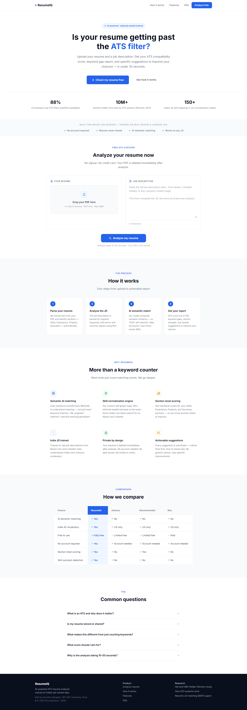
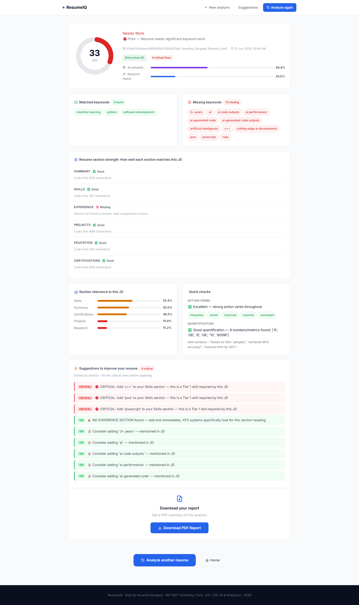
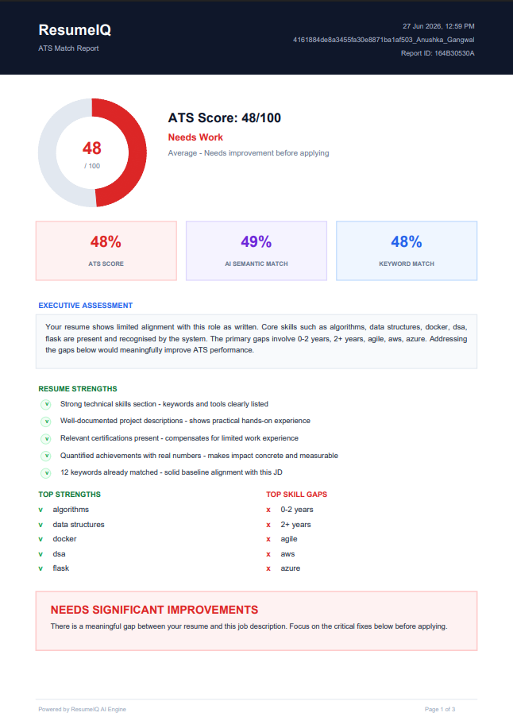

<div align="center">
   
=======
# ResumeIQ -AI-Powered ATS Resume Analyzer

**Helping Indian job seekers understand why their resumes fail ATS filters**


</div>

---

## Problem Statement

Qualified candidates are often rejected by Applicant Tracking Systems (ATS) due to keyword mismatches and resume-job description gaps before reaching recruiters.

## What is ResumeIQ?

ResumeIQ is an AI-powered ATS Resume Analyzer that compares resumes with job descriptions and provides actionable feedback to improve application success.

The system combines keyword matching, semantic similarity analysis, skill normalization, and section-level evaluation to identify gaps between a candidate's resume and employer requirements.

ResumeIQ helps users:

- Measure ATS compatibility (0–100)
- Identify missing keywords and skills
- Analyze resume section quality
- Receive prioritized improvement suggestions
- Generate downloadable ATS reports

Built using Python, Flask, spaCy NLP, and Sentence Transformers (MiniLM-L6-v2).

---

## Screenshots

### Home Page



### Analysis Results



### PDF Report



---

## Key Features

| Feature                      | Description                                                                           |
| ---------------------------- | ------------------------------------------------------------------------------------- |
| **AI Semantic Matching**     | Uses sentence-transformers (MiniLM-L6-v2) to detect meaning, not just exact words     |
| **Skill Normalization**      | 150+ mappings from student phrases to industry terms (e.g. "DSA" → "data structures") |
| **Section-Level Scoring**    | Individual scores for Skills, Experience, Projects, Summary                           |
| **JD Difficulty Classifier** | Detects Entry / Mid / Senior level jobs and warns freshers accordingly                |
| **Smart Synonym Matching**   | Identifies when resume uses different words with same meaning as JD                   |
| **PDF Report Download**      | 3-page professional ATS report with donut chart, keyword analysis, roadmap            |
| **India JD Trained**         | Evaluated on 50 real Naukri.com job descriptions across 5 domains                     |

---

## Evaluation Results

Tested on 10 manually-labelled resume-JD pairs across 5 domains:
(Python Development, Data Analytics, ML/AI, Cybersecurity, Web Development)

| Metric     | Score  |
| ---------- | ------ |
| Precision  | 85.0%  |
| Recall     | 100.0% |
| F1 Score   | 89.3%  |
| Test cases | 10     |
| JD domains | 5      |

> Ground truth labels were derived from the system's own extracted keyword space,
> with human annotators marking which extracted terms represented genuinely missing
> skills. This ensures the evaluation measures classification accuracy rather than
> vocabulary mismatch.

---

## Tech Stack

| Category          | Technology                               |
| ----------------- | ---------------------------------------- |
| **Backend**       | Flask 3.0, Python 3.10+                  |
| **NLP**           | spaCy (en_core_web_sm)                   |
| **AI Model**      | Sentence Transformers (all-MiniLM-L6-v2) |
| **PDF Parsing**   | pdfplumber                               |
| **PDF Reports**   | fpdf2                                    |
| **Frontend**      | HTML, CSS, JavaScript                    |
| **Visualization** | Chart.js                                 |
| **Icons**         | Tabler Icons                             |

---

## How It Works

1. **pdf_parser.py**
   - Extracts raw text from uploaded PDF resumes.

2. **section_extractor.py**
   - Identifies sections such as Skills, Experience, Projects, and Education.

3. **keyword_extractor.py**
   - Extracts and normalizes keywords using `skill_graph.json`.

4. **gap_analyzer.py**
   - Compares resume keywords with job description keywords and calculates keyword match scores.

5. **similarity_engine.py**
   - Performs semantic matching using Sentence Transformers (MiniLM-L6-v2).

6. **jd_classifier.py**
   - Classifies job descriptions into Entry, Mid, or Senior levels.

7. **suggestion_engine.py**
   - Generates prioritized ATS improvement recommendations.

8. **report_generator.py**
   - Creates a downloadable ATS analysis PDF report.

9. **Flask Application**
   - Displays results through a web interface.

---

## Core Innovation - Skill Normalization Engine

The primary research contribution is `skill_graph.json` - a custom knowledge graph containing **150+ mappings** that connect informal student-written resume phrases with industry-standard terminology.

```json
{
  "informal": "worked on backend systems",
  "canonical": ["rest api", "backend development", "api development"],
  "context": "Student way of describing backend work"
}
```

This enables the system to bridge the gap between student-written resume language and recruiter-preferred terminology. By normalizing related concepts into industry-standard skills, ResumeIQ can identify relevant matches that simple keyword-counting systems may overlook.

---

## Installation

### Prerequisites

- Python 3.10+
- pip

### Steps

```bash
# Clone the repository
git clone https://github.com/Anushka-Gangwal017/ats-resume-analyzer.git

# Navigate to project directory
cd ats-resume-analyzer

# Install dependencies
pip install -r requirements.txt

# Download spaCy language model
python -m spacy download en_core_web_sm

# Run the application
python app.py
```

Open your browser at:

```text
http://localhost:5000
```

---

## Project Structure

```text
ats_analyzer/
│
├── app.py                         # Flask application entry point
├── README.md
├── requirements.txt
├── skill_graph.json               # Skill normalization knowledge graph
├── ground_truth.json              # Evaluation ground truth labels
├── evaluation_report.json         # Precision, Recall, F1 results
├── show_missing.py                # Missing keyword inspection tool
│
├── data/                          # Resume and JD datasets
│
├── screenshots/
│   ├── home.png
│   ├── results.png
│   └── report.png
│
├── src/
│   ├── ats_core.py                # Main ATS pipeline
│   ├── pdf_parser.py              # PDF text extraction
│   ├── section_extractor.py       # Resume section detection
│   ├── keyword_extractor.py       # Keyword extraction & normalization
│   ├── gap_analyzer.py            # Keyword gap analysis
│   ├── similarity_engine.py       # Semantic matching engine
│   ├── jd_classifier.py           # JD seniority classification
│   ├── suggestion_engine.py       # ATS improvement suggestions
│   └── report_generator.py        # PDF report generation
│
├── templates/                     # Flask HTML templates
│
├── static/                        # CSS, JavaScript, icons, images
│
└── uploads/                       # Temporary uploaded resumes
```

## Research Context

**Research Question:** Why do resumes fail ATS filters despite candidates being qualified?

**Key Finding:** The mismatch is primarily a vocabulary problem - students describe their skills in informal language while ATS systems search for industry-standard terms. The skill normalization engine directly addresses this gap.

**Dataset:** 50 real job descriptions collected from Naukri.com and LinkedIn India across 5 domains: Python Development, Data Analytics, ML/AI Engineering, Cybersecurity, and Full-Stack Web Development.

### References

- Sigelman, M. et al. (2021). _Hidden Workers: Untapped Talent_. Harvard Business School / Burning Glass Institute.
- Chang, Y. et al. (2020). _BERT-based Resume-Job Description Matching_. arXiv:2009.01484.

---

## Built By

**Anushka Gangwal**

B.Tech Computer Science Engineering (AI & Analytics)  
MIT-ADT University, Pune  
CGPA: 9.08

**LinkedIn:**  
https://linkedin.com/in/anushka-gangwal-020167332

**GitHub:**  
https://github.com/Anushka-Gangwal017

---

_ResumeIQ - Because qualified candidates deserve to be seen._
